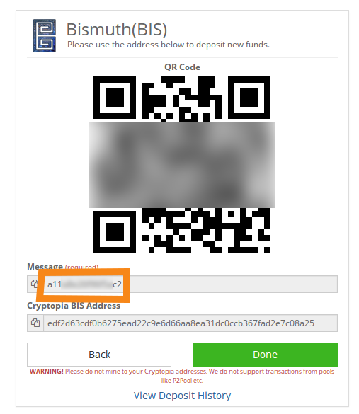
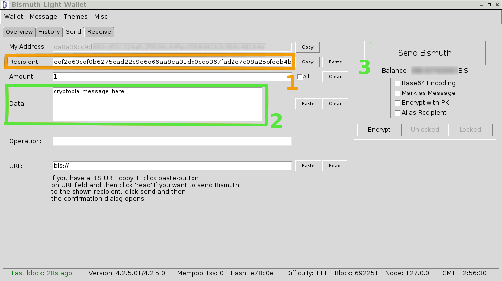

# Working with Cryptopia

(WIP)

## Foreword
To get an idea what Cryptopia is achieving, go there and read the ["Letter from the Founders"](https://www.cryptopia.co.nz/News)  
Cryptopia had an insane amount of new users, and nobody can scale this way without growth issues.  
It takes time.  
And support to more than a million users takes much time. Don't underestimate Cryptopia's will to run it's business.  
This is Crypto, an insane world.

## Timing
Please be aware that your deposit and withdraw need few hours to be processed.  
Cryptopia confirm them 4~6 times per a day. So, it's of no use to open a ticket after a few minutes. Just wait.  
Also, close your open ticket if they are no more needed.

## Cryptopia and BIS
Cryptopia "invested" in BIS. They spent time (hence money) to integrate Bismuth, when it is not yet using the bitcoin standard json-rpc that other clone coins may come with.  
That's a leap of faith, and we are very thankful for that.  
But that also means that some things may not be exactly like you are used to, so listen carefully.

## Deposits to Cryptopia

When you want to send BIS to Cryptopia, you have to read and follow the procedure.  
> As for now, cryptopia has only ONE Bis wallet and Address. Not 10, not one per user. ONE bis address.  
> When you deposit BIS to your Cryptopia wallet, you are in fact sending BIS to cryptopia wallet, and they credit a virtual account with your BIS.  
> So, there needs to be something to link your transaction to your account.  

On the deposit page for your account, You'll see *two things*:
- The Cryptopia bismuth address. You send your BIS there.
- A unique message, your account id, that you MUST insert in the "data" field of your wallet.  
*screen*

Both are equally important.

Your custom cryptopia message is visible on the BIS deposit page, https://www.cryptopia.co.nz/Deposit/Display?currency=BIS&returnUrl=/Exchange

Then from tyour wallet, fill in both address and message:

### Checking your deposit

Once you sent your BIS and it's no more in you wallet, you can check the transaction status on the explorer.  
http://bismuth.online/ledgerquery  
Enter your address, you should see your transaction. By clicking the block number on the left, you get the details of your transaction:  
*screen*

There is your full transaction, with the message (check it's there) and also a Transaction ID.  
If you have to open a Cryptopia ticket, this is what you have to include with your request.

Then wait a moment. This won't show up in the minute.  
The cryptopia Dashboard may take a while to update and show your deposit.  
Then it will show up, but need 100 confirmations before being available.  

> So, *NO HURRY*. Give it one hour to a few hour for appearing on the dashboard, and a little more time to be available.

# Withdrawals from Cryptopia

(WIP)

## When things go wrong

Shit happens. You can make a mistake, there can be a glitch somewhere.  
Be patient.  
Insulting someone won't help. Telling people that's is their fault and what they should do is not helping.

## DO and DON't

- Please don't open unnecessary support tickets on Cryptopia if you can avoid it! One ticket per issue is enough.   
- You absolutely *need* to include the short Message code that's unique to your Cryptopia account when making deposits.  
  Ticking or not the "message" checkbox works either way.  
- If opening a ticket, include all relevant info for the start (see above)
  
  
# Who to contact?

- If the issue is with your wallet.py [https://github.com/hclivess/Bismuth/releases](official wallet release), then use Bismuth (Slack) or (Discord)
- If the issue seems to be with Cryptopia, you can try the (Cryptopia's discord), or if you are sure of the issue and have all info at hand, open a support ticket.
